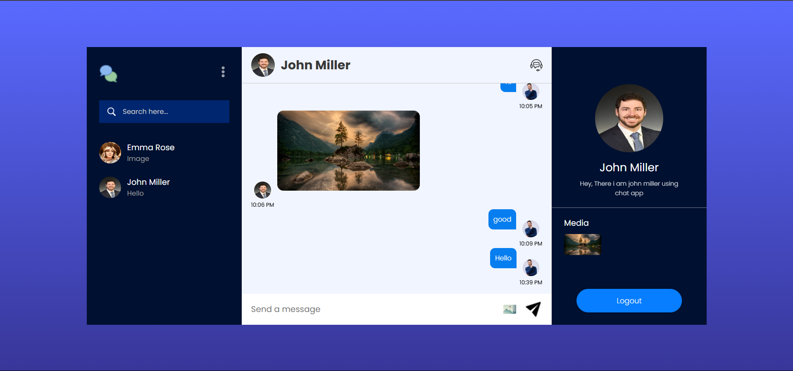

# Chat App using Vite & Firebase

This is a real-time chat application built using **Vite**, **Firebase Authentication**, **Firebase Firestore** for storing messages, and **Firebase Storage** for storing images. Users can send text messages, share images, and have a live chat experience.

## Features
- **Real-time Chat**: Users can send and receive messages in real-time.
- **Authentication**: Users can sign up or log in with their email and password.
- **Message Storage**: All chat messages are stored in **Firestore** and are retrieved instantly.
- **Image Sharing**: Users can upload and send images, which are stored in **Firebase Storage**.
- **Responsive Design**: The chat app is fully responsive and works across devices.

## Tech Stack
- **Frontend**: Vite, React
- **Authentication**: Firebase Authentication
- **Message Storage**: Firebase Firestore
- **Image Storage**: Firebase Storage
- **Real-time Data**: Firestore real-time listeners
- **Styling**: CSS (for simplicity)

## Demo

Here is a preview of the app:


## Setup

### Prerequisites
- Node.js (v16 or above)
- Firebase Account (Firebase Project setup)

### Steps

1. **Clone the repository**:
    ```bash
    git clone https://github.com/your-username/chat-app-vite-firebase.git
    cd chat-app-vite-firebase
    ```

2. **Install dependencies**:
    ```bash
    npm install
    ```

3. **Set up Firebase**:
   - Go to [Firebase Console](https://console.firebase.google.com/), create a new project or use an existing one.
   - In your Firebase project, enable **Authentication** using Email/Password.
   - Set up **Firestore** to store chat messages.
   - Enable **Firebase Storage** for image storage.
   - Download your Firebase config credentials (you'll get this in your Firebase console) and save it as a `.env` file in the root directory with the following format:

     ```bash
     VITE_FIREBASE_API_KEY=your-api-key
     VITE_FIREBASE_AUTH_DOMAIN=your-auth-domain
     VITE_FIREBASE_PROJECT_ID=your-project-id
     VITE_FIREBASE_STORAGE_BUCKET=your-storage-bucket
     VITE_FIREBASE_MESSAGING_SENDER_ID=your-sender-id
     VITE_FIREBASE_APP_ID=your-app-id
     ```

4. **Run the app**:
    ```bash
    npm run dev
    ```

    This will start the development server at [http://localhost:3000](http://localhost:3000).

5. **Deploy the app** (Optional):
   You can deploy the app using platforms like [Vercel](https://vercel.com) or [Netlify](https://www.netlify.com).

## Firebase Setup Instructions

### Authentication
1. Go to **Firebase Console** > **Authentication** > **Sign-in method**.
2. Enable **Email/Password** provider.
3. Make sure you configure the necessary sign-up and login screens in the app.

### Firestore Database
1. Go to **Firebase Console** > **Firestore Database**.
2. Start in **Test mode** for development purposes (make sure to configure security rules before production).
3. Create a collection named `messages`.

### Firebase Storage
1. Go to **Firebase Console** > **Storage**.
2. Enable Firebase Storage.

## Usage

- Users can sign up and log in to the chat app.
- After logging in, users can send and receive text messages instantly.
- Users can also upload and share images within the chat by clicking on the image upload button.
- All messages and images are stored in Firestore and Firebase Storage, respectively.

## Notes

- Make sure to adjust Firestore security rules and Firebase Storage rules before deploying the app to production for better security.
- You can customize the UI as per your requirements.
  
## License

This project is licensed under the MIT License - see the [LICENSE](LICENSE) file for details.

